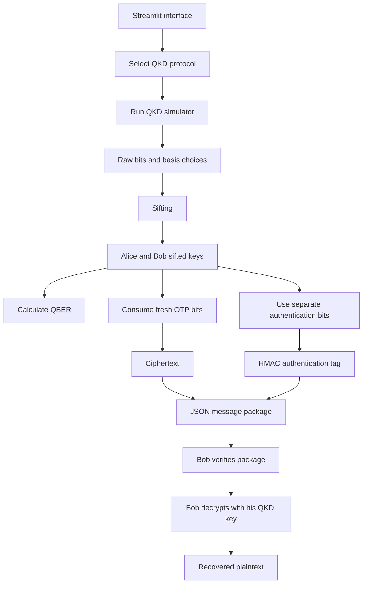
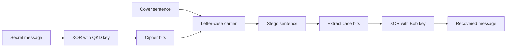

# Quantum Secure Communication
## Complete Project Documentation and Viva Guide

## 1. Project Summary

This project demonstrates secure communication using Quantum Key Distribution (QKD) simulations built with Qiskit. It contains two communication approaches:

1. **Steganography demonstration**
   - Encrypts a message with an XOR operation.
   - Hides the resulting bits in the uppercase/lowercase pattern of a cover sentence.
   - Demonstrates concealment of the existence of communication.

2. **Authenticated QKD message mode**
   - Generates a simulated QKD key using BB84, BBM92, or Ekert91.
   - Uses fresh QKD bits as a non-repeating One-Time Pad (OTP).
   - Uses an additional QKD-derived portion for message authentication.
   - Transfers an ordinary ciphertext package rather than hiding the ciphertext in text.

The second mode is the stronger encryption design. The first mode is retained because it illustrates how encryption and steganography can be combined.

The important conceptual distinction is:

```text
QKD              -> establishes shared random key material
OTP or AES-GCM   -> encrypts and authenticates the message
Steganography    -> conceals the existence or appearance of communication
```

QKD does not directly encrypt an application message.

---

## 2. Problem Statement

Traditional secure communication has two related problems:

1. **Key distribution:** Alice and Bob must obtain the same secret key without allowing an attacker to learn it.
2. **Message protection:** The message must be protected against eavesdropping and tampering.

Classical systems such as RSA and elliptic-curve cryptography solve key establishment using mathematical problems that are believed to be computationally difficult. AES solves symmetric encryption after a key is available.

This project studies a different key-establishment idea: quantum mechanics. In QKD, Alice and Bob use quantum states to create shared random bits. An eavesdropper cannot measure unknown quantum states without introducing a measurable disturbance. Alice and Bob estimate this disturbance using the Quantum Bit Error Rate (QBER).

The project then uses the resulting key material in two ways:

- The original demonstration uses a repeated XOR key and letter-case steganography.
- The secure messaging mode uses a non-repeating OTP and authentication.

---

## 3. Objectives

The project has the following objectives:

- Demonstrate the basic working principles of QKD.
- Implement three well-known protocols: BB84, BBM92, and Ekert91.
- Generate and compare Alice's and Bob's sifted keys.
- Calculate QBER as an indicator of errors or interception.
- Show the effect of quantum gate and readout noise.
- Demonstrate encryption using QKD-derived key material.
- Compare hidden-message steganography with ordinary authenticated ciphertext.
- Provide an interactive Streamlit interface suitable for experiments and demonstrations.
- Make the limitations of a simulator-based educational system explicit.

---

## 4. Important Terminology

### 4.1 Alice and Bob

Alice is the sender and Bob is the receiver. These names are standard in cryptography and quantum communication literature.

### 4.2 Eve

Eve is an attacker or eavesdropper. In a real QKD scenario, Eve attempts to intercept or measure quantum states while remaining undetected.

### 4.3 Qubit

A classical bit is either 0 or 1. A qubit is a quantum system that can be in a superposition of basis states:

$$
|\psi\rangle = \alpha |0\rangle + \beta |1\rangle
$$

where $\alpha$ and $\beta$ are complex amplitudes satisfying:

$$
|\alpha|^2 + |\beta|^2 = 1
$$

When measured, the qubit produces a classical result, 0 or 1, with probabilities determined by the amplitudes.

### 4.4 Quantum basis

A basis specifies how a qubit is prepared or measured. This project uses:

- **Z basis:** computational basis, represented by `Z`.
- **X basis:** diagonal basis, represented by `X`.

The X basis is obtained from the Z basis using the Hadamard gate.

### 4.5 Sifting

Alice and Bob publicly compare their basis choices, not their bit values. They keep only the measurement positions where the relevant bases match. The remaining bits form the sifted key.

### 4.6 QBER

QBER is the fraction of mismatched bits in the sifted keys:

$$
QBER = \frac{\text{number of mismatched sifted bits}}{\text{number of compared sifted bits}}
$$

A low QBER suggests that the channel is behaving correctly. A high QBER can indicate noise, hardware errors, or eavesdropping.

### 4.7 One-Time Pad

An OTP encrypts plaintext bits $M$ using an equally long random key $K$:

$$
C = M \oplus K
$$

Decryption is:

$$
M = C \oplus K
$$

The OTP is information-theoretically confidential only when the key is truly random, at least as long as the message, never reused, and kept secret.

### 4.8 Authentication

Confidentiality prevents an attacker from reading a message. Authentication detects whether a message was modified or forged. The secure messaging mode generates an HMAC-SHA-256 tag over the package metadata and ciphertext.

HMAC is computational authentication, not information-theoretic authentication. A fully information-theoretic design would use a Wegman-Carter MAC and an authenticated classical QKD channel.

---

## 5. System Architecture



The application also has a separate legacy path:



---

## 6. Repository Structure

| File | Responsibility |
|---|---|
| `app.py` | Streamlit application with steganography, secure messaging, and simulator comparison tabs |
| `qkd_protocols.py` | BB84, BBM92, and Ekert91 protocol simulations |
| `secure_messaging.py` | Non-repeating OTP encryption, HMAC authentication, and JSON package handling |
| `steganography.py` | Original XOR-plus-letter-case steganography pipeline |
| `noisy_backend.py` | Ideal and custom noisy Qiskit Aer backends |
| `main.py` | Command-line steganography demonstration |
| `compare_protocols.py` | Generates ideal-versus-noisy comparison charts |
| `requirements.txt` | Python dependencies |
| `README.md` | Short project overview and setup instructions |
| `PROJECT_DOCUMENTATION.md` | Complete theory, implementation, experiment, and viva guide |

---

## 7. QKD Protocols Implemented

### 7.1 BB84

BB84 is a prepare-and-measure protocol proposed by Bennett and Brassard in 1984.

#### Alice's operation

For every position, Alice randomly chooses:

- A random bit, 0 or 1.
- A random basis, Z or X.

She prepares the qubit as follows:

| Bit | Z basis | X basis |
|---|---|---|
| 0 | $|0\rangle$ | $|+\rangle$ |
| 1 | $|1\rangle$ | $|−\rangle$ |

In the implementation:

- Bit 1 is prepared using an X gate.
- X-basis preparation uses a Hadamard gate.

#### Bob's operation

Bob independently chooses a random Z or X basis. If he chooses X, he applies a Hadamard gate before measurement.

After measurement, Alice and Bob compare basis choices. They keep bits only when their bases match.

#### Security intuition

If Eve measures a qubit in the wrong basis, she disturbs the state. When Bob later measures it, the disturbance increases the disagreement rate and therefore the QBER.

#### Expected key rate

Alice and Bob choose between two bases independently. Approximately half the positions survive sifting:

$$
E[|K|] \approx \frac{n}{2}
$$

where $n$ is the number of transmitted qubits.

---

### 7.2 BBM92

BBM92 is an entanglement-based version of BB84.

#### Operation

For each pair:

1. A Bell state $|\Phi^+\rangle$ is created.
2. Alice receives one qubit.
3. Bob receives the other qubit.
4. Both choose either Z or X measurement bases.
5. Matching basis measurements are retained for the sifted key.

The circuit creates the Bell state using:

```text
H on qubit 0
CNOT from qubit 0 to qubit 1
```

The state is:

$$
|\Phi^+\rangle = \frac{|00\rangle + |11\rangle}{\sqrt{2}}
$$

Measurements in the same basis are correlated, so Alice and Bob should obtain equal bits in the ideal simulation.

#### Difference from BB84

- BB84 sends individually prepared states.
- BBM92 uses entangled pairs.
- BBM92 illustrates how entanglement can create correlated measurement results.

---

### 7.3 Ekert91

Ekert91 is an entanglement-based protocol associated with Bell's theorem and CHSH-style measurements.

The implementation uses a singlet state:

$$
|\Psi^-\rangle = \frac{|01\rangle - |10\rangle}{\sqrt{2}}
$$

The singlet state produces anti-correlated results when both parties measure along the same angle.

The implementation defines:

```text
Alice angles: A1 = 0, A2 = pi/4, A3 = pi/2
Bob angles:   B1 = pi/4, B2 = pi/2, B3 = 3*pi/4
```

Key-generating pairs are:

```text
(A2, B1)
(A3, B2)
```

For matching key pairs, Bob's stored key bit is complemented because the singlet results are anti-correlated.

#### Important limitation

The current code uses Ekert91-style key-generating measurements, but it does not calculate the complete CHSH Bell parameter. Therefore, it demonstrates the measurement and sifting mechanics but does not provide a full Bell-inequality security proof.

---

## 8. How the Qiskit Simulation Works

Each protocol builds small circuits and sends them to Qiskit Aer.

The common flow is:

1. Construct a `QuantumCircuit`.
2. Add state-preparation gates.
3. Add basis-selection gates.
4. Add measurement operations.
5. Transpile the circuit using supported basis gates.
6. Execute the circuits with `AerSimulator`.
7. Read measurement memory.
8. Build Alice's and Bob's raw results.
9. Apply sifting.
10. Calculate QBER.

The implementation uses `_run_batch()` rather than constructing one very large circuit. Each qubit or entangled pair is physically independent in these demonstrations, so batching many small circuits reduces memory growth compared with one large statevector circuit.

The simulator uses one shot per small circuit because the protocol needs one sampled measurement outcome for each transmitted qubit or entangled pair.

---

## 9. QBER and Noise Model

### 9.1 Ideal simulator

The ideal backend is `AerSimulator()` with no artificial noise. For BB84 and BBM92, matched basis positions should normally agree exactly. The QBER should be close to zero.

### 9.2 Custom noisy simulator

`noisy_backend.py` adds:

- Single-qubit depolarizing errors.
- Two-qubit depolarizing errors.
- Readout errors.

Default error parameters are approximately:

```text
Single-qubit error: 1%
Two-qubit error:    3%
Readout error:      2%
```

The noisy backend is an educational approximation to a real device. It is not a physical model of one exact IBM processor.

### 9.3 Interpretation of results

A higher noisy QBER is expected because gates and measurements can produce incorrect results. In a real QKD system:

- A small amount of noise may be corrected by error correction and privacy amplification.
- A QBER above the protocol's security threshold should cause the session to abort.
- QBER alone does not prove that an attacker is present; hardware noise can also create errors.

The current demonstration reports QBER but does not implement full error correction or privacy amplification.

---

## 10. Secure Messaging Mode

The secure mode is implemented in `secure_messaging.py` and exposed through the **Secure QKD Message** tab in `app.py`.

### 10.1 Key allocation

For a message containing $L$ UTF-8 bytes, the required QKD key length is:

$$
8L + 128 \text{ bits}
$$

The key is divided into two parts:

```text
First 8L bits       -> OTP encryption key
Next 128 bits       -> HMAC authentication key
```

The key is never cycled. If the sifted key is too short, encryption is rejected.

### 10.2 Encryption

The message is encoded as UTF-8 bytes. For each byte, the corresponding eight QKD bits are converted to a byte and XORed with the plaintext byte:

$$
C_i = M_i \oplus K_i
$$

The ciphertext is Base64 encoded so that it can be safely stored in JSON.

### 10.3 Authentication

The remaining 128 QKD bits become the HMAC key. The tag covers:

```text
package format
protocol name
message length
Base64 ciphertext
```

The tag is computed using HMAC-SHA-256.

This prevents an attacker from silently modifying the ciphertext or changing its metadata. Bob verifies the tag before attempting decryption.

### 10.4 Package format

A message package looks conceptually like this:

```json
{
  "format": "qkd-otp-message-v1",
  "protocol": "BB84",
  "message_length_bytes": 25,
  "key_bits_used": 328,
  "ciphertext": "...base64 ciphertext...",
  "tag": "...hex HMAC tag..."
}
```

The receiver key package contains:

```json
{
  "format": "qkd-otp-key-v1",
  "protocol": "BB84",
  "receiver_key": [0, 1, 1, 0,  ...]
}
```

### 10.5 Receiver verification sequence

Bob performs these checks in order:

1. Confirm the key package format.
2. Confirm that the selected protocol matches the message package.
3. Confirm that the receiver key is long enough.
4. Recalculate the HMAC tag.
5. Compare tags using constant-time comparison.
6. Decode Base64 ciphertext.
7. Confirm ciphertext length.
8. XOR ciphertext with the OTP key bits.
9. Decode the resulting bytes as UTF-8.

If authentication fails, the message is rejected instead of being displayed.

### 10.6 AES-GCM as the practical message-encryption option

The current secure messaging implementation uses a one-time pad because it is
useful for demonstrating information-theoretic confidentiality. However, an
OTP requires fresh key material equal to the complete message length, which is
expensive for long messages because QKD produces a limited sifted-key rate.

AES-GCM is the practical alternative for a deployable version of this project.
It combines:

- **AES:** a standardized symmetric block cipher for confidentiality.
- **GCM:** Galois/Counter Mode, which provides authenticated encryption.
- **Authentication tag:** detects ciphertext or metadata modification.
- **Nonce:** a unique per-message value required for safe GCM use.

The production-oriented architecture would be:

```text
QKD sifted key
    |
Key derivation or key allocation
    |
256-bit AES key + unique nonce
    |
AES-GCM encrypt(message, associated_data)
    |
Ciphertext + nonce + authentication tag
```

The receiver would use the corresponding QKD-derived AES key, nonce, and
authentication tag to verify and decrypt the message. If verification fails,
the plaintext must be discarded.

AES-GCM is different from the current OTP mode:

| Property | Current OTP mode | AES-GCM mode |
|---|---|---|
| Key size | One fresh bit per message bit plus authentication bits | Fixed key, commonly 128 or 256 bits |
| Key reuse | Forbidden | A key may protect multiple messages only with a unique nonce per message |
| Confidentiality | Information-theoretic under OTP conditions | Computational, based on AES security |
| Integrity | HMAC-SHA-256 tag in this project | GCM authentication tag |
| Long messages | Requires a large QKD key | Efficient with limited QKD key material |
| Best use | Demonstrating theoretical maximum secrecy | Practical application communication |

QKD can periodically provide fresh AES keys or key material for deriving AES
keys. This creates a hybrid system: quantum mechanics protects key
establishment, while AES-GCM efficiently protects the application data.

AES-GCM is not currently enabled as a Streamlit encryption option. It is a
documented next implementation step. When added, the package should include
the algorithm identifier, key/session identifier, nonce, ciphertext, tag, and
any non-secret associated data. The AES key itself must never be included in
the package.

---

## 11. Two-System Demonstration Procedure

The current application supports a file-transfer demonstration of sender and receiver roles.

### Sender machine

1. Start the application.
2. Open **Secure QKD Message**.
3. Select **Sender**.
4. Select BB84, BBM92, or Ekert91.
5. Enter the message.
6. Choose enough qubits for the required key length.
7. Click **Generate QKD key for secure message**.
8. Confirm that the sifted key is long enough and QBER is acceptable.
9. Click **Encrypt and authenticate**.
10. Download:
    - `qkd_receiver_key.json`
    - `qkd_encrypted_message.json`

### Receiver machine

1. Start the same application.
2. Open **Secure QKD Message**.
3. Select **Receiver**.
4. Upload both JSON packages.
5. The application authenticates and decrypts the message.
6. Modify one character in the ciphertext package to demonstrate rejection.

### Important demonstration limitation

The current simulator runs the QKD protocol locally and exports Bob's simulated key as a file. This is not a real quantum network and should not be described as production QKD. A real system would establish the receiver's key over a secure quantum channel and use an authenticated classical channel for basis reconciliation and protocol control.

---

## 12. Original Steganography Demonstration

The first Streamlit tab preserves the original project idea.

### Pipeline

```text
Secret message
      |
UTF-8 bytes
      |
XOR with QKD key, cycling if necessary
      |
Cipher bits
      |
Hide one bit in each alphabetic character's case
      |
Stego sentence
```

The carrier uses:

```text
lowercase letter -> 0
uppercase letter -> 1
non-letter        -> unchanged
```

The receiver reads the case pattern, extracts the encrypted bits, and XORs them with Bob's key.

### Capacity

The capacity is the number of alphabetic characters in the cover text:

$$
Capacity(cover) = \sum_{c \in cover} [c \text{ is alphabetic}]
$$

A message containing $L$ UTF-8 bytes requires $8L$ carrier letters.

### Advantages

- The ciphertext is not visually obvious as a random byte string.
- It demonstrates concealment in addition to encryption.
- It is easy to understand in a classroom demonstration.

### Weaknesses

- Unusual capitalization can be detected statistically.
- It has low capacity.
- The original path cycles the QKD key, so it is not a true OTP.
- It does not provide authentication.
- A message can be corrupted if the carrier text is changed.

The steganography path should therefore be presented as an educational comparison, not as the strongest security mode.

---

## 13. Difference from Classical Encryption

### RSA and elliptic-curve cryptography

RSA and ECC are public-key systems. Their security relies on computational assumptions such as integer factorization or the elliptic-curve discrete logarithm problem.

QKD is a key-establishment method based on quantum measurement properties rather than the assumed difficulty of a mathematical problem.

### AES

AES is a symmetric block cipher. It is highly practical and widely deployed, but its security is computational. An attacker with unlimited computational power is theoretically able to search the key space.

A true OTP has information-theoretic confidentiality, provided the key requirements are satisfied.

### Steganography

Steganography attempts to hide the existence of a message. It is not a replacement for encryption. A detected stego message still needs cryptographic protection.

### This project

The project combines these concepts for teaching:

- QKD simulation for key generation.
- OTP for message confidentiality.
- HMAC for integrity and authentication.
- Steganography as a separate concealment experiment.

---

## 14. Security Claims and Correct Wording

### Correct claims

The project can demonstrate that:

- Different QKD protocols produce correlated sifted keys in an ideal simulation.
- Noise increases QBER.
- A non-repeating XOR key can provide OTP-style confidentiality in the simulation.
- Package tampering is detected by authentication.
- Steganography can conceal data from casual inspection.

### Claims to avoid

Do not claim that:

- The current application is a real quantum communication network.
- The simulator proves physical security against all attacks.
- Exporting a receiver key file is secure in a hostile environment.
- HMAC is information-theoretic authentication.
- Ekert91 security is fully implemented, because CHSH statistics are not calculated.
- Repeated-key XOR is a true one-time pad.
- Steganography makes communication undetectable.

### Strong presentation statement

> This project is an educational simulation of QKD-assisted secure communication. It compares a concealment-oriented steganography path with an authenticated OTP path. The secure path enforces fresh key consumption and demonstrates tamper rejection, while the simulator illustrates QKD correlations and noise through QBER.

---

## 15. Application Workflow

### Streamlit tabs

#### Steganography Demo

- Select protocol.
- Select number of qubits.
- Enter a secret message.
- Generate a QKD key.
- Enter a cover sentence.
- Encrypt into letter case.
- Decode using Bob's key.

#### Secure QKD Message

Sender mode:

- Select protocol.
- Enter the message.
- Select number of qubits.
- Generate a QKD key.
- Check sifted-key length and QBER.
- Encrypt and authenticate.
- Download receiver key and ciphertext packages.

Receiver mode:

- Upload the receiver key package.
- Upload the ciphertext package.
- Verify authentication.
- Decrypt and display the message.

#### Compare Simulators

- Select the number of qubits or entangled pairs.
- Run each protocol on an ideal backend and noisy backend.
- View ideal and noisy QBER values.
- View a comparison bar chart.

---

## 16. Running the Project on Windows

From PowerShell, use the project virtual environment explicitly:

```powershell
.\source\Scripts\python.exe -m pip install -r requirements.txt
.\source\Scripts\python.exe -m streamlit run app.py
```

The explicit interpreter is recommended because PowerShell may not find a globally installed `streamlit` command.

Run the command-line demo with:

```powershell
.\source\Scripts\python.exe main.py
```

Generate comparison plots with:

```powershell
.\source\Scripts\python.exe compare_protocols.py
```

The project requires Python packages listed in `requirements.txt`:

```text
qiskit
qiskit-aer
matplotlib
numpy
streamlit
```

---

## 17. Suggested Experiments

### Experiment 1: Ideal BB84

- Run BB84 with 32 or 64 qubits.
- Observe that approximately half the bits survive sifting.
- Observe QBER close to zero.

### Experiment 2: Compare all protocols

- Run BB84, BBM92, and Ekert91.
- Compare the number of sifted bits.
- Explain that basis or angle matching determines the key rate.

### Experiment 3: Add noise

- Run the comparison tab.
- Compare ideal and noisy QBER.
- Explain that depolarizing and readout errors create mismatches.

### Experiment 4: Test OTP key length

- Enter a longer secure message.
- Keep the qubit count low.
- Observe that encryption is rejected when the sifted key is too short.

### Experiment 5: Test authentication

- Generate and download a secure message package.
- Modify the ciphertext or tag manually.
- Upload the modified file.
- Observe that the receiver rejects it.

### Experiment 6: Test wrong-key decryption

- Use a key package from a different QKD run.
- Upload it with the original ciphertext package.
- The authentication tag should fail.

### Experiment 7: Compare concealment and encryption

- Use the steganography tab and observe a readable cover sentence with unusual capitalization.
- Use secure QKD message mode and observe ordinary Base64 ciphertext.
- Explain that the former hides existence while the latter focuses on cryptographic confidentiality and integrity.

---

## 18. Complexity and Performance

Let $n$ be the number of simulated qubits or entangled pairs.

- Raw bit and basis generation: approximately $O(n)$.
- Circuit construction: approximately $O(n)$ small circuits.
- Batch simulation: depends on backend and circuit count, but avoids one exponentially large statevector circuit.
- Sifting: $O(n)$.
- QBER calculation: $O(n)$.
- OTP encryption: $O(L)$ for a message of $L$ bytes.
- HMAC calculation: $O(L)$.
- Steganographic encoding: $O(C)$ for a cover text of $C$ characters.

Memory use is controlled by batching independent circuits, but very large simulations still require more CPU and memory.

---

## 19. Limitations

### 19.1 Simulation instead of real quantum hardware

Qiskit Aer models quantum circuits on a classical computer. It does not create a physically separated quantum channel. The project demonstrates protocol logic, not deployed quantum security.

### 19.2 Missing error correction and privacy amplification

Real QKD systems perform:

- Error correction or information reconciliation.
- Privacy amplification.
- Key-rate estimation.
- Session abort decisions based on security thresholds.

The current code reports QBER but does not implement the complete post-processing pipeline.

### 19.3 Authentication model

The secure mode uses HMAC-SHA-256. HMAC is practical and detects tampering, but it relies on computational cryptographic assumptions. An information-theoretic QKD system would use an authenticated classical channel and a Wegman-Carter MAC.

### 19.4 Receiver key file

The demo exports Bob's simulated key in a JSON file. Anyone who obtains that file can decrypt the message. In a real system, key material must be delivered through the QKD process and protected in memory.

### 19.5 Ekert91 does not calculate CHSH

The implementation includes Ekert91-style angle selection and singlet correlations, but it does not compute a Bell or CHSH statistic. This should be identified as future work.

### 19.6 Steganography detectability

Letter-case steganography is simple but can be detected by statistical analysis. It should not be presented as invisible communication.

### 19.7 Key rate

QKD produces fewer usable sifted bits than the number of transmitted qubits. The secure mode therefore needs more qubits than the message length, especially because 128 additional bits are reserved for authentication.

---

## 20. Future Improvements

A stronger research version could add:

1. Error correction and information reconciliation.
2. Privacy amplification using a universal hash family.
3. A configurable QBER abort threshold.
4. A proper Wegman-Carter information-theoretic MAC.
5. Complete CHSH correlation analysis for Ekert91.
6. Real hardware backends through IBM Quantum services.
7. Secure key storage instead of JSON export.
8. Session identifiers and replay protection.
9. Key-consumption tracking to prevent accidental reuse.
10. Implement AES-GCM as a practical alternative when OTP key material is
    insufficient, including unique nonce management and package versioning.
11. Automated unit tests for all protocol and cryptographic paths.
12. A separate network service for authenticated sender/receiver communication.
13. More natural steganographic carriers if concealment remains a requirement.

---

## 21. Suggested Viva Presentation Structure

### Slide 1: Title

Quantum Secure Communication Using QKD Simulation and Steganography

### Slide 2: Motivation

- Classical key distribution problem.
- Risk of eavesdropping.
- Need for confidentiality and tamper detection.

### Slide 3: Core idea

```text
Quantum protocol -> shared key -> message protection -> receiver verification
```

### Slide 4: QKD protocols

Introduce BB84, BBM92, and Ekert91 in one or two sentences each.

### Slide 5: BB84 circuit

Show state preparation, basis selection, measurement, and sifting.

### Slide 6: QBER

Explain the formula and how noise or Eve increases the error rate.

### Slide 7: Secure message mode

Explain key allocation:

```text
message bits + authentication bits
```

### Slide 8: Steganography comparison

Explain that steganography hides the existence of data, while OTP protects content.

### Slide 9: Results

Show ideal-versus-noisy QBER and a successful authenticated round trip.

### Slide 10: Limitations and future work

Be explicit that the current system is a simulator and that real QKD requires quantum hardware and authenticated classical post-processing.

---

## 22. Two-Minute Explanation

> Our project demonstrates secure communication using simulated Quantum Key Distribution. Alice and Bob use BB84, BBM92, or Ekert91 to generate correlated random bits. They compare their basis or angle choices and retain only matching positions, producing sifted keys. We calculate QBER to measure disagreement caused by simulation noise or a possible eavesdropper.
>
> The project contains two message paths. The original path encrypts a message using XOR and hides the encrypted bits in the capitalization of a cover sentence. This demonstrates steganography, but it has limited capacity and can be detected. The stronger path uses the QKD key as a non-repeating one-time pad. It reserves separate key bits for an HMAC authentication tag, so Bob rejects modified ciphertext before decryption. The application provides sender and receiver modes through JSON packages.
>
> The implementation is an educational Qiskit simulation rather than a real quantum network. It does not yet implement full QKD error correction, privacy amplification, or CHSH analysis, and the exported receiver key is only suitable for demonstration. A production version would use real quantum hardware, authenticated classical communication, secure key storage, and complete QKD post-processing.

---

## 23. Likely Viva Questions and Answers

### Q1. What is the main purpose of QKD?

QKD establishes shared random key material between two parties and provides a way to detect disturbance in the quantum channel. It does not directly encrypt the application message.

### Q2. Why does Eve cause errors?

Quantum measurement generally disturbs a state when Eve does not know the preparation basis. This disturbance changes some of Bob's measurement results and increases QBER.

### Q3. Why do Alice and Bob discard some bits?

They discard positions where their bases or measurement settings do not match. Those positions do not produce reliably correlated results.

### Q4. What is the difference between BB84 and BBM92?

BB84 prepares and measures individual qubits. BBM92 distributes entangled pairs and uses correlated measurements.

### Q5. What is special about Ekert91?

It uses entanglement and multiple measurement angles related to Bell or CHSH tests. The current implementation demonstrates the key-generating correlations but does not calculate the full CHSH value.

### Q6. Why is QBER important?

QBER measures disagreement between sifted keys. It helps identify noise, implementation errors, or possible eavesdropping.

### Q7. Why is OTP stronger than repeated XOR?

A true OTP uses a random key at least as long as the message and never reuses it. Repeating a short key creates patterns that can be attacked. The secure module refuses to cycle a short key.

### Q8. Why do we need authentication if encryption is secure?

Encryption protects confidentiality but does not necessarily prove who sent the message or whether it was modified. Authentication detects tampering and forgery.

### Q9. Is HMAC information-theoretically secure?

No. HMAC-SHA-256 is computationally secure under assumptions about the hash function and key secrecy. A Wegman-Carter MAC would be used for information-theoretic authentication.

### Q10. Is the current project quantum encryption?

More precisely, it is QKD-assisted classical message protection. The QKD part is simulated quantum key establishment; the message is encrypted classically using OTP.

### Q11. Why is the key package not secure in a real network?

Because the demonstration exports the receiver's key in a file. Anyone who obtains that file can decrypt the ciphertext. A real QKD implementation would establish and store the key locally on Bob's system.

### Q12. Can steganography be detected?

Yes. Letter-case patterns can be statistically analyzed. Steganography hides the existence of a message but does not guarantee invisibility.

### Q13. What happens if the message is changed?

In secure mode, the HMAC tag no longer matches and Bob rejects the message. In the original steganography mode, there is no authentication tag, so corruption may only appear as an incorrect decoded message.

### Q14. Why are more qubits needed than message bits?

Sifting discards many raw bits. The secure mode also reserves 128 bits for authentication. Therefore, the number of transmitted qubits must be larger than the final message key requirement.

### Q15. What is the most important limitation?

The system uses a classical simulator rather than a physically separated quantum communication channel. Therefore, it demonstrates protocol behavior and software integration, not real-world quantum security.

---

## 24. Final Technical Conclusion

The project is best understood as a layered educational system:

```text
Quantum layer:
    Qiskit circuits, quantum bases, entanglement, measurements

QKD layer:
    basis selection, sifting, correlated keys, QBER

Cryptographic layer:
    OTP confidentiality, HMAC authentication

Application layer:
    JSON packages, Streamlit controls, sender/receiver workflow

Comparison layer:
    steganography versus ordinary authenticated ciphertext
```

Its main contribution is not that a simulator replaces a production cryptosystem. Its value is that it makes the relationship between quantum key establishment, classical encryption, authentication, noise, and steganographic concealment visible in one executable project.
